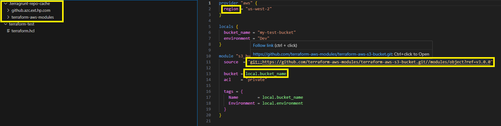

# Navigation for Terraform and Terragrunt Codes

### Features
- **Path Navigation**: Quickly navigate to Terraform and Terragrunt files and folders.
- **Git Integration**: Automatically download and navigate to git paths.
- **Syntax Highlighting**: Enhanced syntax highlighting for keys and values.
- **Terraform Variable Defaults**: Show the variable details on hover over `var`

### How to Use
- **Path Recognition**:
  - Recognized paths will be underlined.
  - Hover the mouse over the path to check the resolved path.
  - Use `Ctrl+Click` or `F12` to navigate to that file/folder.
  - If it is a git path, it will be downloaded to the home directory under .terragrunt-repo-cache
    - The folder will be loaded in the workspace.
    - It will navigate to the `main.tf` file or the first `.tf` file found.
- **Key and Value Recognition**:
  - Recognized keys and values will be shown in different colors.
  - Hover the mouse over the key/value to get the resolved value.
  - Hover the mouse over the `var` to see the variable details like type, default values etc.

### Requirements
- AWS_ACCOUNT_ID should be available in the evironment variable otherwise default value will be used
- Install terraform or hcl extension if you want code syntax highlight
- **Git**: Required for downloading and navigating to git paths.
  - For git checkout, it used ssh based key for checkout or using http without password.
    Make sure that you clone a repo atleast once from the github org before trying from extension

### Installation
1. Install the extension from the Visual Studio Code Marketplace.

### Support
For any issues or feature requests, please open an issue on the [GitHub repository](https://github.com/HPInc/terragrunt-navigator).

### License
This extension is licensed under the [MIT License](LICENSE).
