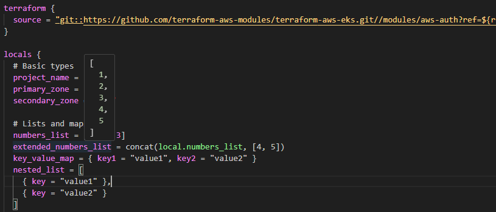
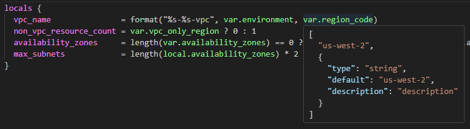
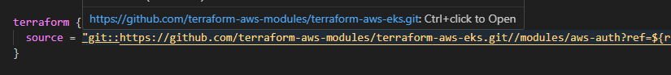
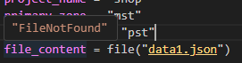

# Simplifying Terragrunt and Terraform Workflows with Terragrunt/Terraform Navigator

Managing Terraform and Terragrunt configurations can be challenging, especially when dealing with complex infrastructures involving multiple Terraform modules and submodules. Enter the Terragrunt/Terraform Navigator, a Visual Studio Code extension designed to streamline and enhance your workflow. In this blog, we’ll explore how this extension can revolutionize the way you work with Terraform and Terragrunt.

## The Challenge
Terraform and Terragrunt are powerful tools for managing infrastructure as code. However, navigating through numerous `.hcl` and `.tf` files, understanding variable dependencies, and managing configurations can be tedious and error prone. Developers often find themselves switching between various tools and scripts to complete their tasks.

## The Solution: Terragrunt/Terraform Navigator
The Terragrunt/Terraform Navigator extension is a game-changer for developers working with Terraform and Terragrunt. It integrates seamlessly with Visual Studio Code, offering a range of features that simplify configuration management and boost efficiency.

Consider a scenario where you’re tasked with updating a complex Terragrunt configuration involving multiple Terraform modules (and submodules). Typically, you would start with the Terragrunt file where your module is referenced. Let’s look at how the Terragrunt/Terraform Navigator can make this process much easier.

### Document Links and Decorations
Once the extension is installed, your files will automatically display decorations and clickable links, if applicable. The decorations use yellow, green, and violet colors:
- **Yellow text**: Clickable links.
- **Violet text**: Displays computed values when hovered over.
- **Green text**: Displays variable values and descriptions when hovered over.

This functionality helps you understand the final values without needing to open other files or calculate them manually.

### Git Repo Navigation and Caching
Let's say, you have a source module referenced in your Terragrunt configuration, and you want to learn more about it. Normally, you would need to clone the repository or navigate to it using a browser. With this extension, a simple `Ctrl+click` or `F12` on the source link automatically clones the repository and adds it to your workspace. It also switches to the module. BTW, there’s a feature toggle that allows you to prevent the cloned repository from being added to your workspace. If the repo referenced is already present in the workspace, it will skip the clone.

But that’s not all. When switching to the Terraform module, the input values from Terragrunt are passed along, ensuring that the variables in the Terraform module reflect the inputs provided by Terragrunt. Hovering over these variables displays the input value (or the default value if no input is provided) along with the variable’s description. This enables you to view details such as type, description, and default value without opening another file. Isn’t that convenient?

These features significantly accelerate workflows involving Terragrunt and Terraform, while also reducing confusion and helping you stay organized when working with multiple submodules.

### Terragrunt and Terraform Functions
Around 50 commonly used Terraform and Terragrunt functions are implemented. For example, using `file` to read the contents of a file, `find_in_parent_folders` to search for a file, `read_terragrunt_config` for reading Terragrunt config, to name a few.

### File Navigation
If your configuration references a folder or file using `source`, `config_path`, or `file`, these references will be decorated in yellow with an underline. Hovering over them shows the resolved path, and you can use `Ctrl+Click` or `F12` to navigate to the location.

[Resolved path shown on hover. Use `Ctrl+click` or `F12` to open the location. File location start is masked](images/filepath.png)

### Miscellaneous Features
Additional features of the extension include caching of Terraform modules to speed up subsequent access and the following features which can be invoked via the Command Palette (`Ctrl+Shift+P`):

- Support for string replacement of source paths  
- Feature toggles for customizing the extension  
- Saving inputs from Terragrunt configurations in JSON format  

## How to Get Started

### Installation
Install the Terragrunt Navigator extension from the Visual Studio Code marketplace. [Terragrunt/Terraform Navigator — Visual Studio Marketplace](https://marketplace.visualstudio.com/items?itemName=TerragruntNavigator)

Ensure you have the necessary dependencies like Git and Bash installed on your system.

### Activating the Extension
Note: Please make sure that the Language Mode in the Status bar (towards bottom right corner of VSCode -> Select Language Mode) is set to “Plain Text”, “Terraform”, “Terragrunt” or “hcl” for the `.hcl` and `.tf` files.

The extension activates automatically when you open a `.hcl` or `.tf` file in your workspace. You will see decorations and links appear in your editor.

## Benefits
- **Improved Productivity**: Quickly navigate and edit Terragrunt configurations without leaving your editor.  
- **Error Reduction**: Hover tooltips and decorations help you understand and debug configurations more effectively.  
- **Seamless Git Integration**: Automatically clone and open repositories referenced in your configurations.  
- **Customizable**: Tailor the extension to your workflow with feature toggles and replacement strings.  

## Conclusion
The Terragrunt Navigator extension is more than just a tool; it’s a productivity enhancer for developers working with Terraform and Terragrunt. By simplifying navigation, improving understanding, and automating repetitive tasks, it allows you to focus on what truly matters — building and managing robust infrastructure.

Try the Terragrunt Navigator today and experience the difference it can make in your workflow. Happy coding!

Bugs or feature requests can be added here: [Issues · terragrunt-navigator](https://github.com/terragrunt-navigator/issues). Please note this is a side project, so expect delays.
